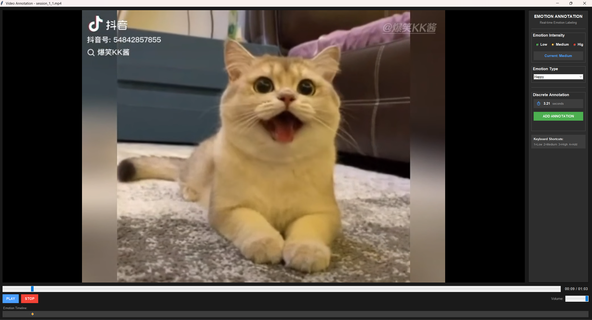
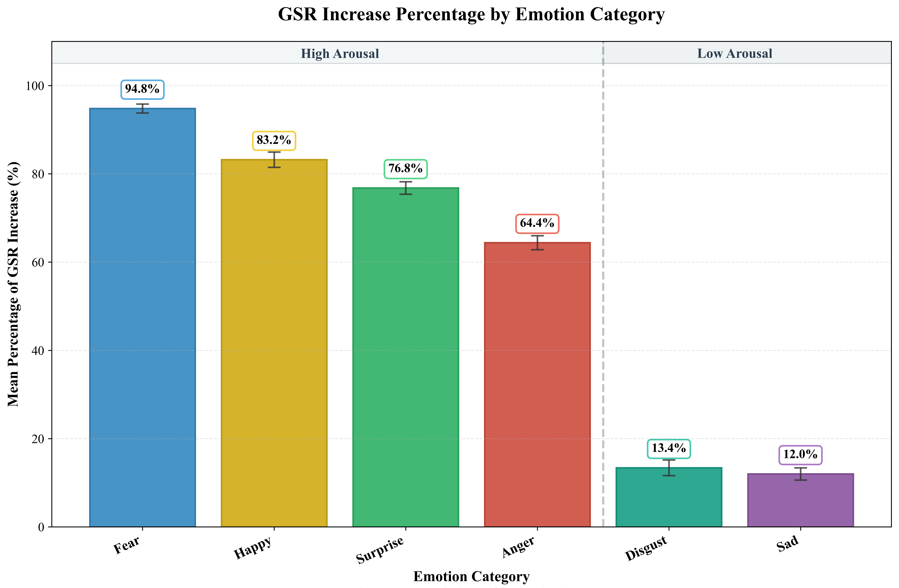

# FIRMED
# 🎬 FIRMED: A Peak-Centered Multimodal Dataset with Fine-Grained Annotation for Emotion Recognition

> **Official Repository for the ACM Multimedia 2026 Dataset Track submission:** > *"FIRMED: A Peak-Centered Multimodal Dataset with Fine-Grained Annotation for Emotion Recognition"*

---

## 📖 Overview

Traditional video-induced physiological datasets predominantly rely on coarse, whole-trial labels, which introduce **Temporal Label Noise**. To bridge this gap, we present **FIRMED** (Fine-grained Immediate Recall-based Multimodal Emotion Dataset). 
<p align="center">
  
  <br>
  <em>Figure 1: Experimental paradigm for FIRMED data collection, encompassing the multi-session design, trial timeline (baseline, stimulus, immediate recall replay, rest), multimodal signal acquisition, and the multi-dimensional annotation structure.</em>
</p>

Instead of assigning a single global label to an entire trial, FIRMED utilizes a novel **Immediate-Recall annotation paradigm**. Participants report their self-perceived emotional peaks immediately following stimulus exposure, yielding precise event-centered timestamps ($t_{event}$) for temporally localized supervision.

<p align="center">
  
  <br>
  <em>Figure 2: The Immediate-Recall Annotation Interface used in FIRMED.</em>
</p>

## ✨ Key Features

- **Ecologically Valid Stimuli:** 90 short-video stimuli sourced from modern social media platforms (high information density, rapid emotional fluctuations).
- **Rich Multimodal Signals:** Synchronized 59-channel EEG, 3-channel ECG, 2-channel GSR, 1-channel PPG, and frontal facial videos.
- **High-Fidelity Annotations:** Peak-centered timestamps aligned with strict objective neural and autonomic arousal patterns.
- **Comprehensive Demographics:** Data from 35 participants, including Big Five personality profiles to account for subjective variations.

<p align="center">
  
  <br>
  <em>Figure 2: Autonomic arousal validation showing distinct SCR patterns across different emotion categories.</em>
</p>

## 📂 Repository Structure

```text
FIRMED-Dataset/
├── imgs/                     # UI screenshots and physiological validation figures
├── Data_Samples/                # Toy data samples demonstrating the data structure
├── Supplementary_Material.pdf   # Extended EEG topographic maps and demographic details
├── README.md                    # Project overview
Once the paper is accepted, the dataset will be made public.
